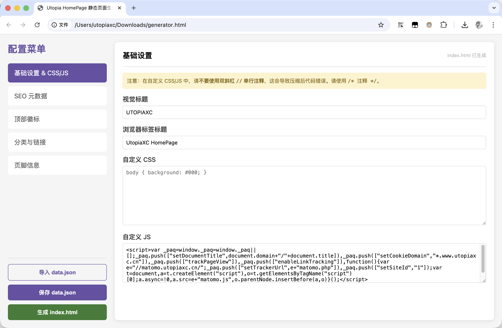
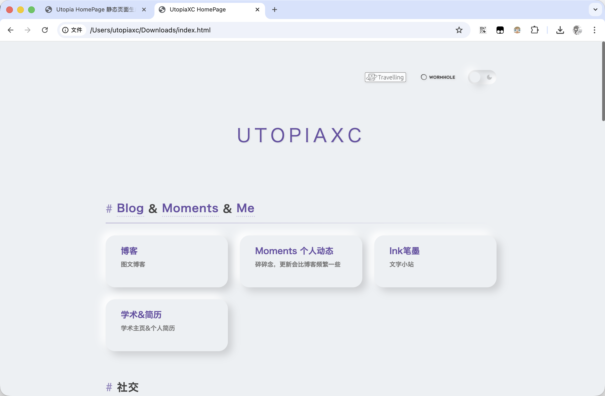

## Utopia HomePage

快，就是一切。

纯静态的个人导航主页生成器。无需数据库，无需复杂配置。上手快，生成快，访问快，反正就是快，别管好不好看好不好用，你就说快不快吧。

### 使用方法

#### 在线使用

访问[Generate HomePage](https://generate-homepage.utopiaxc.cn/)

1. 填写全部条目 或 已经有data.json的话可以直接上传json后修改条目
2. 点击生成index.html

#### 下载使用

下载本仓库，在本地浏览器打开generator.html

### Demo

生成器：[Generate HomePage](https://generate-homepage.utopiaxc.cn/)

生成的HTML效果：[UtopiaXC HomePage](https://www.utopiaxc.cn/)

  

### QA

Q. 为什么不用数据库？

A. 不够快，我之前用的是PHP+数据库，生成的页面700K，访问需要700ms，改用本地json后生成物只有21k，网络好的话10ms以内就能加载出来。而且我之前懒着写数据库管理界面，每次都是直接用DBeaver进数据库后台改数据，费劲。

Q. 这是什么设计语言？

A. 新拟物，我觉得蛮好看的。

Q. 为什么要生成导航主页？

A. 因为网站太多，主页放一个导航页比较方便。

### 许可

请在遵守MIT协议与各国法律法规的情况下，随意使用本项目。  

严禁用于违法用途，一切二次开发行为与使用行为与本仓库作者无关，本仓库作者不负任何相关责任。  

请支持开源项目不要移除底部源仓库信息。

### 捐赠

请不要在任何渠道以任何方式为本项目付出金钱。
如果您想捐助本项目，您可以向慈善组织或开放源代码促进会（开源组织，OSI）捐款，我们会感激不尽。